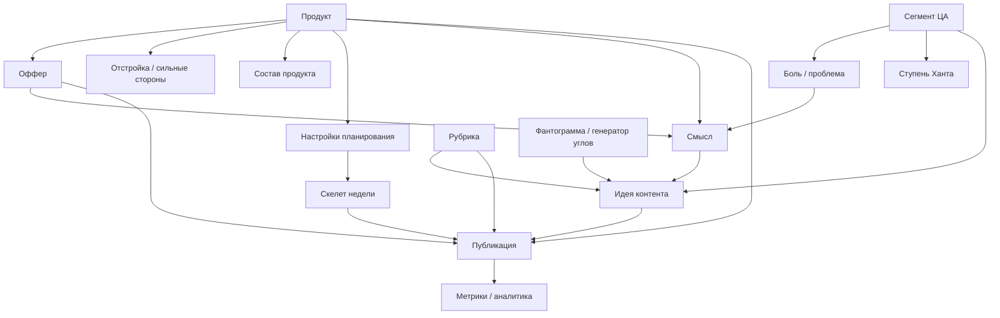
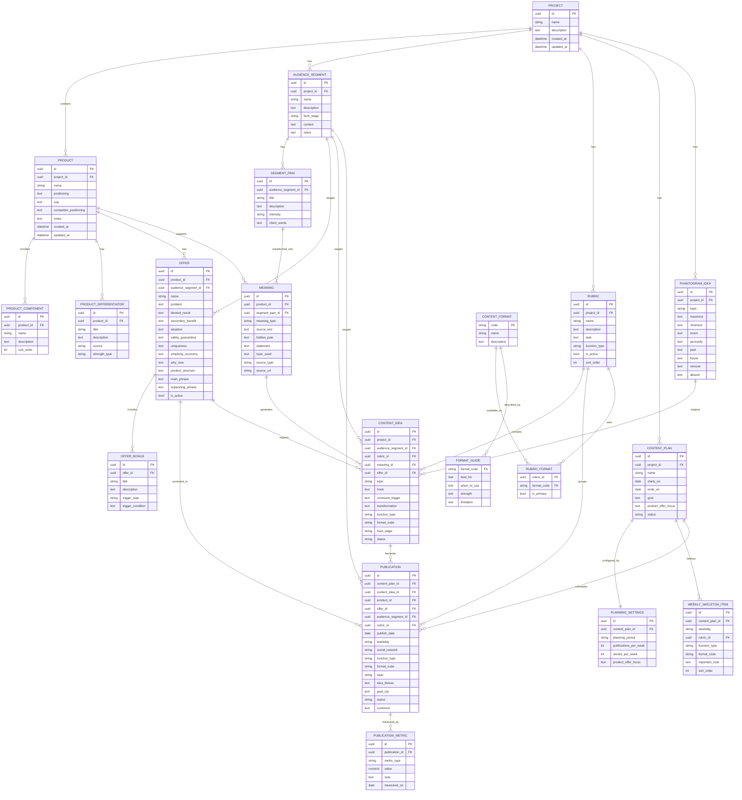
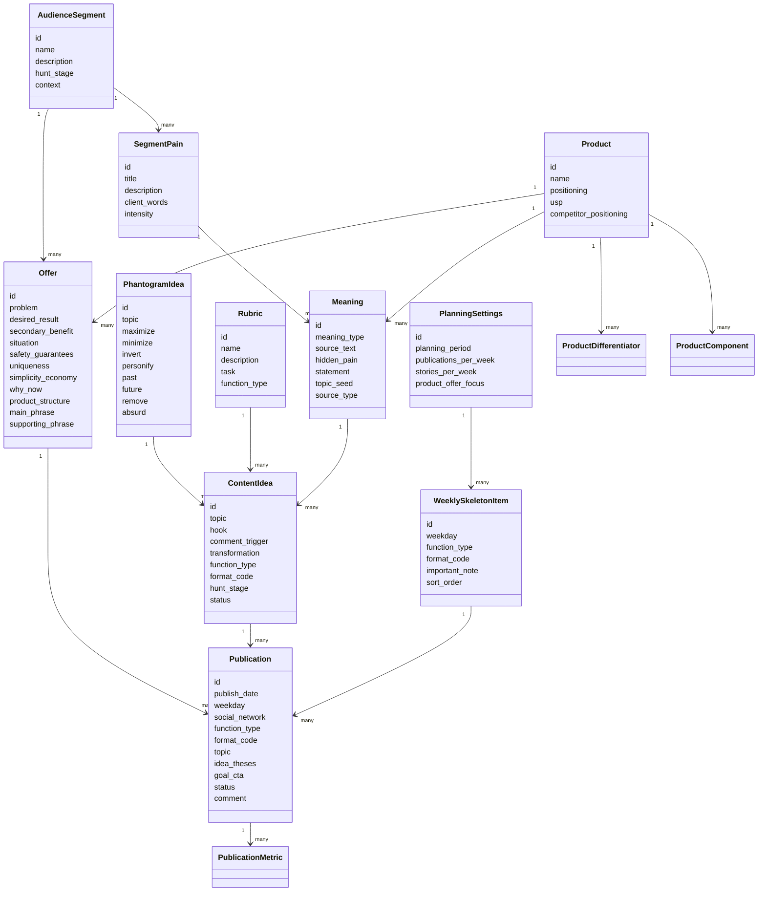

# Модель данных проекта по контент-маркетингу

## Назначение модели

Эта модель описывает сущности для интерфейса и будущей базы данных проекта, где пользователь сможет:

- описывать продукт, позиционирование, УТП и отстройку от конкурентов;
- собирать офферы;
- описывать сегменты ЦА, боли и ступени Ханта;
- собирать смыслы, рубрики, идеи и публикации;
- вести контент-план;
- анализировать результат публикаций.

Источник:

- конспекты `kontent-marketing-modul-1-smysly-i-idei.md` и `kontent-marketing-modul-2-sistema-kontenta.md`;
- Google Sheet "Смыслы": продукт, сегменты ЦА, идеи, рубрики;
- Google Sheet "Конструктор": структура оффера;
- Google Sheet "Система ведения контента": контент-план, рубрикатор, скелет недели, таблица смыслов, форматы, примеры рубрик, фантограмма, справочники.

Что добавлено после сверки с третьей таблицей:

- `PlanningSettings`: период планирования, публикаций в неделю, сторис в неделю, фокус продукта / оффера.
- `WeeklySkeletonItem`: день недели, рубрика / функция, формат, что важно.
- `FormatGuide`: назначение формата, когда использовать, сильная сторона, ограничение.
- `PhantogramIdea`: генератор углов подачи темы.
- Быстрая проверка баланса по функциям: польза, доверие, кейс, продажа + сервис.

## Верхнеуровневая логика



## ERD



## Mermaid UML class diagram



## Сущности и поля

### Project

Рабочее пространство проекта. Нужно, чтобы в будущем можно было вести несколько продуктов / брендов.

| Поле | Тип | Обяз. | Описание |
| --- | --- | --- | --- |
| `id` | uuid | да | Идентификатор |
| `name` | string | да | Название проекта |
| `description` | text | нет | Описание |
| `created_at` | datetime | да | Создано |
| `updated_at` | datetime | да | Обновлено |

### Product

Продукт или бренд, для которого строится контент-система.

| Поле | Тип | Обяз. | Описание |
| --- | --- | --- | --- |
| `id` | uuid | да | Идентификатор |
| `project_id` | uuid | да | Проект |
| `name` | string | да | Название продукта |
| `positioning` | text | да | Позиционирование: какую проблему, для кого и каким методом решаем |
| `usp` | text | да | УТП |
| `competitor_positioning` | text | нет | Отстройка от конкурентов |
| `notes` | text | нет | Дополнительные заметки |

### ProductDifferentiator

Отстройка, сильная сторона или конкурентное преимущество.

| Поле | Тип | Обяз. | Описание |
| --- | --- | --- | --- |
| `id` | uuid | да | Идентификатор |
| `product_id` | uuid | да | Продукт |
| `title` | string | да | Короткое название преимущества |
| `description` | text | да | Расшифровка |
| `source` | string | нет | Откуда взято: конкурентный анализ, отзыв, гипотеза |
| `strength_type` | enum | нет | Тип преимущества: метод, сервис, цена, скорость, безопасность, удобство, качество |

### ProductComponent

То, из чего состоит продукт.

| Поле | Тип | Обяз. | Описание |
| --- | --- | --- | --- |
| `id` | uuid | да | Идентификатор |
| `product_id` | uuid | да | Продукт |
| `name` | string | да | Название элемента |
| `description` | text | нет | Что входит |
| `sort_order` | int | нет | Порядок отображения |

### Offer

Конструктор оффера. Может быть общим или персонализированным под сегмент.

| Поле | Тип | Обяз. | Описание |
| --- | --- | --- | --- |
| `id` | uuid | да | Идентификатор |
| `product_id` | uuid | да | Продукт |
| `audience_segment_id` | uuid | нет | Сегмент, если оффер персонализирован |
| `name` | string | да | Название оффера |
| `problem` | text | да | Проблема |
| `desired_result` | text | да | Результат решения |
| `secondary_benefit` | text | нет | Вторичная выгода / потребность |
| `situation` | text | нет | Ситуативка, где проявляется проблема |
| `safety_guarantees` | text | нет | Безопасность / гарантии |
| `uniqueness` | text | нет | Уникальность / сильная сторона |
| `simplicity_economy` | text | нет | Почему меньше времени / денег / усилий |
| `why_now` | text | нет | Почему действовать сейчас |
| `product_structure` | text | нет | Из чего состоит продукт |
| `main_phrase` | text | нет | Основная фраза оффера |
| `supporting_phrase` | text | нет | Вспомогательная фраза |
| `is_active` | boolean | да | Активен ли оффер |

Формула основной фразы:

```text
Решение проблемы + результат + уникальность/сильная сторона + простота/экономия + гарантии/безопасность + бонус с триггером
```

Расширенная формула:

```text
Решение проблемы + результат через потребность + ситуация клиента + безопасность/гарантии + уникальность + простота/экономия + почему сейчас + состав продукта + бонус с триггером
```

### OfferBonus

Киллер-бонус и триггер.

| Поле | Тип | Обяз. | Описание |
| --- | --- | --- | --- |
| `id` | uuid | да | Идентификатор |
| `offer_id` | uuid | да | Оффер |
| `title` | string | да | Название бонуса |
| `description` | text | нет | Описание |
| `trigger_type` | enum | нет | Тип триггера |
| `trigger_condition` | text | нет | Условие: срок, лимит мест, первые N участников |

### AudienceSegment

Сегмент целевой аудитории.

| Поле | Тип | Обяз. | Описание |
| --- | --- | --- | --- |
| `id` | uuid | да | Идентификатор |
| `project_id` | uuid | да | Проект |
| `name` | string | да | Название сегмента |
| `description` | text | да | Описание |
| `hunt_stage` | enum | да | Ступень Ханта |
| `context` | text | нет | Контекст жизни / ситуации |
| `notes` | text | нет | Заметки |

### SegmentPain

Боль конкретного сегмента. Вынесена отдельно, потому что у одного сегмента может быть несколько болей.

| Поле | Тип | Обяз. | Описание |
| --- | --- | --- | --- |
| `id` | uuid | да | Идентификатор |
| `audience_segment_id` | uuid | да | Сегмент |
| `title` | string | да | Краткое название боли |
| `description` | text | да | Описание |
| `client_words` | text | нет | Дословные формулировки клиента |
| `intensity` | enum | нет | Сила боли: low, medium, high |

### Meaning

Смысл, который нужно донести контентом.

| Поле | Тип | Обяз. | Описание |
| --- | --- | --- | --- |
| `id` | uuid | да | Идентификатор |
| `product_id` | uuid | да | Продукт |
| `segment_pain_id` | uuid | нет | Боль, из которой вырос смысл |
| `meaning_type` | enum | да | Идея, эксперт, продукт |
| `source_text` | text | нет | Дословная формулировка из источника |
| `hidden_pain` | text | нет | Что болит на самом деле |
| `statement` | text | да | Сам смысл |
| `topic_seed` | text | нет | Черновая тема / заголовок |
| `source_type` | enum | нет | Threads, форум, отзыв, конкурент, интервью, другое |
| `source_url` | string | нет | Ссылка на источник |

### Rubric

Повторяющееся смысловое направление.

| Поле | Тип | Обяз. | Описание |
| --- | --- | --- | --- |
| `id` | uuid | да | Идентификатор |
| `project_id` | uuid | да | Проект |
| `name` | string | да | Название рубрики |
| `description` | text | нет | Описание |
| `task` | text | да | Задача рубрики |
| `function_type` | enum | да | Функция: польза, доверие, продажа и т.д. |
| `is_active` | boolean | да | Используется ли |
| `sort_order` | int | нет | Порядок отображения |

### ContentIdea

Идея публикации до постановки в календарь.

| Поле | Тип | Обяз. | Описание |
| --- | --- | --- | --- |
| `id` | uuid | да | Идентификатор |
| `project_id` | uuid | да | Проект |
| `audience_segment_id` | uuid | нет | Сегмент |
| `rubric_id` | uuid | нет | Рубрика |
| `meaning_id` | uuid | нет | Связанный смысл |
| `offer_id` | uuid | нет | Связанный оффер |
| `topic` | string | да | Тема |
| `hook` | text | нет | Крючок захвата внимания |
| `comment_trigger` | text | нет | Триггер на комментарий |
| `transformation` | text | нет | Какое изменение восприятия должно произойти |
| `function_type` | enum | да | Функция контента |
| `format_code` | enum | нет | Предпочтительный формат |
| `hunt_stage` | enum | нет | Ступень Ханта |
| `status` | enum | да | Статус идеи |

### ContentPlan

План на неделю, месяц или другой период.

| Поле | Тип | Обяз. | Описание |
| --- | --- | --- | --- |
| `id` | uuid | да | Идентификатор |
| `project_id` | uuid | да | Проект |
| `name` | string | да | Название |
| `starts_on` | date | да | Начало |
| `ends_on` | date | да | Конец |
| `goal` | text | нет | Что аудитория должна понять за период |
| `product_offer_focus` | text | нет | Фокус продукта / оффера на период |
| `status` | enum | да | Draft, active, archived |

### PlanningSettings

Настройки планирования из верхней части шаблона контент-плана.

| Поле | Тип | Обяз. | Описание |
| --- | --- | --- | --- |
| `id` | uuid | да | Идентификатор |
| `content_plan_id` | uuid | да | Контент-план |
| `planning_period` | string | нет | Период планирования в человекочитаемом виде |
| `publications_per_week` | int | нет | Плановое количество публикаций в неделю |
| `stories_per_week` | int | нет | Плановое количество сторис в неделю |
| `product_offer_focus` | text | нет | Фокус продукта / оффера |

### WeeklySkeletonItem

Скелет недели: распределение функций, рубрик и форматов по дням до наполнения конкретными темами.

| Поле | Тип | Обяз. | Описание |
| --- | --- | --- | --- |
| `id` | uuid | да | Идентификатор |
| `content_plan_id` | uuid | да | Контент-план |
| `weekday` | enum | да | День недели |
| `rubric_id` | uuid | нет | Рубрика, если уже выбрана |
| `function_type` | enum | нет | Функция дня / публикации |
| `format_code` | enum | нет | Формат |
| `important_note` | text | нет | Что важно учесть в этот день |
| `sort_order` | int | нет | Порядок отображения |

### Publication

Единица контент-плана.

| Поле | Тип | Обяз. | Описание |
| --- | --- | --- | --- |
| `id` | uuid | да | Идентификатор |
| `content_plan_id` | uuid | да | Контент-план |
| `content_idea_id` | uuid | нет | Идея-источник |
| `product_id` | uuid | нет | Продукт |
| `offer_id` | uuid | нет | Оффер |
| `audience_segment_id` | uuid | нет | Сегмент |
| `rubric_id` | uuid | да | Рубрика |
| `publish_date` | date | да | Дата |
| `weekday` | enum/string | нет | День недели, можно вычислять из даты |
| `social_network` | enum | да | Соцсеть |
| `function_type` | enum | да | Функция |
| `format_code` | enum | да | Формат |
| `topic` | string | да | Тема |
| `idea_theses` | text | нет | Идея / тезисы |
| `goal_cta` | text | нет | Цель / CTA |
| `status` | enum | да | Статус |
| `comment` | text | нет | Комментарий |

### PublicationMetric

Простая аналитика публикации.

| Поле | Тип | Обяз. | Описание |
| --- | --- | --- | --- |
| `id` | uuid | да | Идентификатор |
| `publication_id` | uuid | да | Публикация |
| `metric_type` | enum | да | Тип метрики |
| `value` | numeric | да | Значение |
| `note` | text | нет | Короткий вывод |
| `measured_on` | date | да | Дата фиксации |

### FormatGuide

Справочник форматов из листа `Формат`. Это не просто enum, а подсказки для интерфейса при выборе формата.

| Поле | Тип | Обяз. | Описание |
| --- | --- | --- | --- |
| `format_code` | enum | да | Формат |
| `best_for` | text | да | Для чего лучше подходит |
| `when_to_use` | text | да | Когда использовать |
| `strength` | text | да | Сильная сторона |
| `limitation` | text | нет | Ограничение |

Пример: `Короткий пост` подходит, чтобы быстро зацепить, подсветить боль и дать одну мысль; ограничение - не подходит для сложного объяснения.

### PhantogramIdea

Фантограмма - генератор нестандартных углов подачи темы. Это не обязательная часть контент-плана, а инструмент для размножения идей.

| Поле | Тип | Обяз. | Описание |
| --- | --- | --- | --- |
| `id` | uuid | да | Идентификатор |
| `project_id` | uuid | да | Проект |
| `topic` | string | да | Базовая тема |
| `maximize` | text | нет | Увеличить до предела |
| `minimize` | text | нет | Уменьшить до минимума |
| `invert` | text | нет | Сделать наоборот |
| `personify` | text | нет | Оживить / персонифицировать |
| `past` | text | нет | Перенести в прошлое |
| `future` | text | нет | Перенести в будущее |
| `remove` | text | нет | Убрать совсем |
| `absurd` | text | нет | Довести до абсурда |

## Перечисления

### HuntStage

В интерфейсе можно показывать как ступени осведомленности.

| Код | Название | Смысл |
| --- | --- | --- |
| `unaware` | Проблемы нет | Человек еще не видит проблему |
| `problem_aware` | Проблема есть | Человек осознал боль |
| `solution_search` | Поиск решения | Ищет способы решить |
| `solution_found` | Решение найдено | Понимает тип решения |
| `vendor_choice` | Выбор исполнителя / продукта | Сравнивает варианты |
| `ready_to_buy` | Готов к покупке | Нужен оффер и следующий шаг |

Можно хранить и числом `0-5`, но строковый код понятнее для интерфейса.

### MeaningType

| Код | Название |
| --- | --- |
| `idea` | Продает идею |
| `expert` | Продает эксперта |
| `product` | Продает продукт |

### ContentFunction

Функция контента - предзаданный enum.

В третьей таблице справочник содержит базовые значения: `Польза`, `Доверие`, `Кейс`, `Продажа`, `Сервис`. Остальные значения ниже можно оставить как расширение для будущей версии интерфейса.

| Код | Название | Когда использовать |
| --- | --- | --- |
| `reach` | Охват | Захват внимания, широкий вход |
| `benefit` | Польза | Обучение, объяснение, инструкции |
| `trust` | Доверие | Личное в рабочем контексте, ценности, бекстейдж |
| `case_result` | Кейсы / результаты | Доказательства, до/после, отзывы |
| `product_education` | Объяснение продукта | Как работает продукт / метод |
| `objection_handling` | Снятие возражений | Страхи, сомнения, риски |
| `engagement` | Вовлечение | Комментарии, реакции, обсуждения |
| `lead_magnet` | Лид-магнит | Переход в бесплатный материал / подписку |
| `sales` | Продажа | Оффер, заявка, покупка |
| `service` | Сервис | Как попасть, как заказать, условия, процесс |

### ContentFormat

Формат контента - предзаданный enum.

В третьей таблице справочник содержит базовые значения: `Пост`, `Сторис`, `Короткое видео`, `Карусель`, `Эфир`, `Гайд / чек-лист`, `Длинное видео`, `Разбор`.

| Код | Название |
| --- | --- |
| `reels` | Reels / короткое вертикальное видео |
| `video` | Видео |
| `long_video` | Длинное видео |
| `talking_head` | Говорящая голова |
| `post` | Пост |
| `carousel` | Карусель |
| `stories` | Stories |
| `longread` | Лонгрид |
| `guide` | Гайд |
| `checklist` | Чек-лист |
| `live` | Эфир |
| `webinar` | Вебинар |
| `qa` | Вопрос-ответ |
| `case_review` | Разбор |
| `screencast` | Скринкаст |
| `audio` | Аудио |
| `static_visual` | Статичный визуал |

### SocialNetwork

Соцсеть - предзаданный enum.

В третьей таблице справочник содержит базовые значения: `Instagram`, `Telegram`, `VK`, `YouTube`, `Email`, `Другое`.

| Код | Название |
| --- | --- |
| `instagram` | Instagram |
| `telegram` | Telegram |
| `vk` | VK |
| `vk_clips` | VK Клипы |
| `youtube` | YouTube |
| `youtube_shorts` | YouTube Shorts |
| `tiktok` | TikTok |
| `threads` | Threads |
| `website` | Сайт |
| `email` | Email |
| `podcast` | Podcast |
| `other` | Другое |

### PublicationStatus

В третьей таблице справочник содержит базовые значения: `План`, `В работе`, `Готово`, `Вышло`.

| Код | Название |
| --- | --- |
| `idea` | Идея |
| `plan` | План |
| `draft` | Черновик |
| `in_progress` | В работе |
| `ready` | Готово |
| `scheduled` | Запланировано |
| `published` | Вышло |
| `archived` | Архив |

### OfferTriggerType

| Код | Название |
| --- | --- |
| `time_limit` | Ограничение по времени |
| `quantity_limit` | Ограничение по количеству |
| `first_n` | Для первых N человек |
| `bonus_deadline` | Бонус до даты |
| `price_increase` | Повышение цены |
| `event_date` | Привязка к событию |

### MetricType

| Код | Название | Для какой функции чаще всего |
| --- | --- | --- |
| `views` | Просмотры | Охват |
| `reach` | Охват | Охват |
| `watch_rate` | Досмотры | Польза, прогрев |
| `reads` | Дочитывания | Посты, лонгриды |
| `saves` | Сохранения | Польза |
| `shares` | Репосты | Охват, доверие |
| `comments` | Комментарии | Вовлечение |
| `replies` | Ответы | Доверие, stories |
| `dm` | Сообщения в личку | Продажа, доверие |
| `clicks` | Клики | Лид-магнит, продажа |
| `leads` | Заявки | Продажа |
| `purchases` | Покупки | Продажа |

### SourceType

| Код | Название |
| --- | --- |
| `threads` | Threads |
| `forum` | Форум |
| `competitor_comments` | Комментарии конкурентов |
| `reviews` | Отзывы / отзовики |
| `marketplace` | Маркетплейс |
| `interview` | Интервью |
| `internal` | Внутренняя гипотеза |
| `analytics` | Аналитика |

## MVP-срез базы данных

Для первой версии интерфейса достаточно этих таблиц:

1. `products`
2. `offers`
3. `offer_bonuses`
4. `audience_segments`
5. `segment_pains`
6. `meanings`
7. `rubrics`
8. `content_ideas`
9. `content_plans`
10. `planning_settings`
11. `weekly_skeleton_items`
12. `publications`
13. `publication_metrics`
14. `phantogram_ideas`

Опционально для подсказок интерфейса:

15. `format_guides`

Справочники можно начать как hardcoded enums в приложении:

- `content_functions`
- `content_formats`
- `social_networks`
- `hunt_stages`
- `publication_statuses`
- `metric_types`

Позже, если нужен админский интерфейс, их можно вынести в таблицы.

Быстрая проверка баланса из таблицы не требует отдельной сущности: ее можно считать как агрегат по `Publication.function_type` внутри выбранного `ContentPlan`.

## Интерфейсные экраны

### 1. Продукт

Редактирует:

- название;
- позиционирование;
- УТП;
- отстройку от конкурентов;
- состав продукта;
- сильные стороны.

Связанные блоки:

- офферы;
- смыслы;
- публикации, где продукт продвигается.

### 2. Конструктор оффера

Редактирует `Offer` и `OfferBonus`.

Поля формы:

- проблема;
- результат;
- вторичная выгода;
- ситуативка;
- безопасность / гарантии;
- уникальность;
- простота / экономия;
- почему сейчас;
- состав продукта;
- бонус и триггер.

Автогенерируемые поля:

- основная фраза;
- вспомогательная фраза.

### 3. Сегменты ЦА

Редактирует:

- описание сегмента;
- ступень Ханта;
- боли;
- дословные формулировки.

Полезные действия:

- создать смысл из боли;
- создать идею контента из боли;
- привязать оффер к сегменту.

### 4. Банк смыслов

Редактирует `Meaning`.

Поля:

- источник;
- дословная формулировка;
- скрытая боль;
- тип смысла;
- смысл;
- тема / заголовок;
- связанный продукт / боль / сегмент.

### 5. Рубрикатор

Редактирует `Rubric` и `RubricFormat`.

Поля:

- название;
- описание;
- задача;
- функция;
- форматы;
- активность.

Проверки:

- есть ли у рубрики задача;
- связана ли с продуктом;
- есть ли 2-3 формата;
- можно ли придумать 5-10 тем.

### 6. Справочник форматов

Редактирует или показывает `FormatGuide`.

Поля из третьей таблицы:

- формат;
- для чего лучше подходит;
- когда использовать;
- сильная сторона;
- ограничение.

В интерфейсе это лучше использовать как подсказку при выборе формата в рубрике, идее и публикации.

### 7. Фантограмма

Редактирует `PhantogramIdea`.

Поля:

- тема;
- увеличить до предела;
- уменьшить до минимума;
- сделать наоборот;
- оживить / персонифицировать;
- перенести в прошлое;
- перенести в будущее;
- убрать совсем;
- довести до абсурда.

Назначение: быстро размножать одну тему в разные углы подачи и превращать удачные варианты в `ContentIdea`.

### 8. Банк идей

Редактирует `ContentIdea`.

Поля из доступной таблицы:

- сегмент ЦА;
- рубрика;
- тема;
- крючок захвата внимания;
- триггер на комментирование;
- трансформация;
- формат;
- этап лестницы Ханта.

### 9. Настройки и скелет недели

Редактирует `PlanningSettings` и `WeeklySkeletonItem`.

Настройки:

- период планирования;
- публикаций в неделю;
- сторис в неделю;
- фокус продукта / оффера.

Скелет недели:

- день недели;
- рубрика / функция;
- формат;
- что важно.

Назначение: сначала распределить функции и рубрики по дням, а уже потом переносить конкретные темы в живой контент-план.

### 10. Контент-план

Редактирует `Publication`.

Колонки:

- дата;
- день;
- соцсеть;
- рубрика;
- функция;
- формат;
- тема;
- идея / тезисы;
- цель / CTA;
- продукт / оффер;
- статус;
- комментарий.

Проверки:

- нет ли подряд тяжелой экспертности;
- есть ли баланс пользы, доверия, кейсов и продаж;
- есть ли CTA в нужных публикациях;
- каждая продажная публикация связана с оффером;
- каждая публикация связана с рубрикой.

Быстрая проверка баланса:

- сколько публикаций с функцией `Польза`;
- сколько с функцией `Доверие`;
- сколько с функцией `Кейс`;
- сколько с функциями `Продажа` и `Сервис`.

Если где-то ноль, интерфейс должен подсказать проверить план.

### 11. Аналитика

Редактирует `PublicationMetric`.

Минимальная логика:

- для пользы смотреть сохранения и дочитывания / досмотры;
- для доверия смотреть комментарии, ответы, сообщения, репосты;
- для продаж смотреть клики, заявки, покупки;
- после анализа принимать решение: усилить, изменить, убрать.

## Валидации

### Product

- `name`, `positioning`, `usp` обязательны.
- У продукта должен быть хотя бы один активный оффер перед сборкой продажного контента.

### Offer

- `problem`, `desired_result`, `product_id` обязательны.
- Если `audience_segment_id` задан, оффер считается персонализированным.
- `main_phrase` можно генерировать из полей конструктора.

### AudienceSegment

- `name`, `description`, `hunt_stage` обязательны.
- Желательно минимум одна боль.

### Rubric

- `name`, `task`, `function_type` обязательны.
- Желательно 2-3 формата.

### ContentIdea

- `topic`, `function_type` обязательны.
- Если идея на продажу, желательно указать `offer_id`.

### Publication

- `publish_date`, `social_network`, `rubric_id`, `function_type`, `format_code`, `topic`, `status` обязательны.
- Если `function_type = sales`, нужен `offer_id` или `product_id`.
- Если `function_type = lead_magnet`, нужен CTA.

### PlanningSettings

- Если задано `publications_per_week`, живой контент-план не должен сильно превышать этот объем без предупреждения.
- `product_offer_focus` должен совпадать с активным продуктом / оффером периода либо быть текстовой гипотезой.

### WeeklySkeletonItem

- `weekday` обязателен.
- Желательно заполнить хотя бы одно из полей: `rubric_id`, `function_type`, `format_code`.
- Если в скелете недели выбран день, но в живом плане нет публикации на этот день, интерфейс может показывать мягкое предупреждение.

### PhantogramIdea

- `topic` обязателен.
- Хотя бы одно поле угла подачи должно быть заполнено перед созданием `ContentIdea`.

## Практическая схема работы пользователя

1. Заполняет продукт: позиционирование, УТП, отстройка.
2. Создает сегменты ЦА и боли.
3. Собирает офферы под продукт и, при необходимости, под сегменты.
4. Из болей и источников собирает смыслы.
5. Собирает рубрики и выбирает для них форматы.
6. При необходимости размножает темы через фантограмму.
7. Создает банк идей.
8. Задает настройки планирования и скелет недели.
9. Переносит идеи в контент-план.
10. Проверяет баланс функций.
11. После публикации заносит метрики.
12. Принимает решение: усилить, изменить или убрать.
